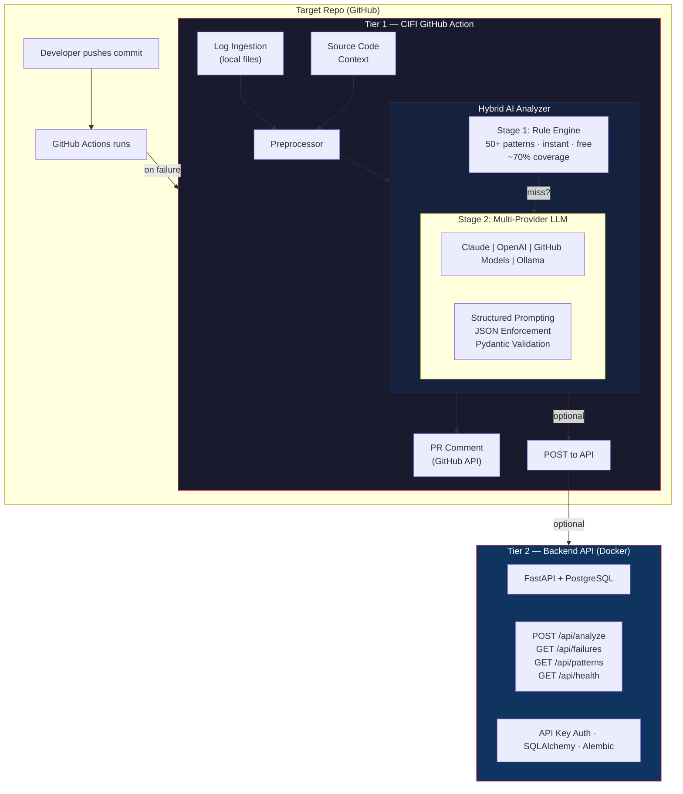
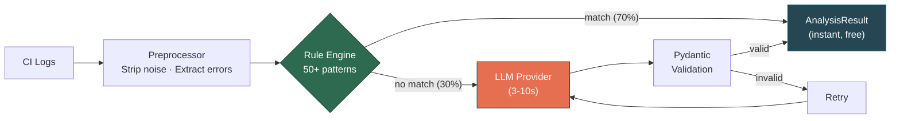
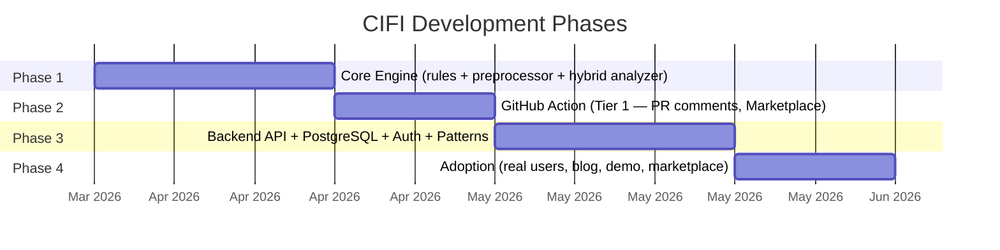

# CIFI — CI Failure Intelligence

AI-powered CI failure analysis that lives inside your GitHub Actions workflow. Add 3 lines, get instant root cause analysis on every failure. No infrastructure required.

---

## What It Does

When a CI step fails, CIFI:

1. **Reads** logs and source code directly from the checkout (full repo context)
2. **Matches** against 50+ known failure patterns via rule engine (~70% of failures, instant, free)
3. **Falls back** to LLM analysis for complex failures (GitHub Models API — free with `GITHUB_TOKEN`)
4. **Posts** a structured PR comment with root cause + suggested fix
5. **Tracks** (optional) recurring failure patterns via the backend API

---

## Quick Start

```yaml
# Add to your workflow file
- uses: alihaidar2950/cifi@v1
  if: failure()
  with:
    github-token: ${{ secrets.GITHUB_TOKEN }}
```

That's it. No API keys, no infrastructure, no configuration.

---

## Architecture

CIFI uses a **two-tier architecture** with a **hybrid AI analysis core**:



### Tier 1 — GitHub Action (Embedded)
Runs inside your CI pipeline. Has full access to source code, logs, and test output. Performs hybrid analysis (rules first, LLM fallback) and posts PR comments. **This is all most teams need.**

### Tier 2 — Backend API (Optional)
A FastAPI backend with PostgreSQL persistence. Stores failure history, detects recurring patterns across repos, and exposes a RESTful API with pagination, filtering, and authentication.

---

## Hybrid Analysis



| Stage | Speed | Cost | Coverage |
|---|---|---|---|
| Rule Engine (50+ patterns) | Instant | Free | ~70% of failures |
| LLM Fallback (GitHub Models) | 3-10s | Free | ~95% of failures |

The rule engine handles common failures (assertion errors, missing dependencies, syntax errors, etc.) without any API call. The LLM is only invoked for complex failures the rules don't cover.

---

## Tech Stack

| Component | Technology |
|---|---|
| Core Engine | Python 3.11+, regex rule engine, Pydantic |
| Tier 1 | GitHub Action (Docker container) |
| LLM Providers | GitHub Models API (free), Claude, OpenAI, Ollama |
| Backend API | FastAPI, async Python |
| Database | PostgreSQL, SQLAlchemy 2.0 (async), Alembic |
| Auth | API key middleware |
| Deployment | Docker, Fly.io / Railway / Cloud Run |
| CI/CD | GitHub Actions |

---

## Project Structure

```
cifi/               # Core engine: rules, preprocessor, analyzer, schemas
  llm/              # Multi-provider LLM (claude, openai, github-models, ollama)
action/             # GitHub Action: entrypoint, Dockerfile, action.yml
backend/            # Backend API service (Phase 3)
  routers/          # FastAPI route handlers
  services/         # Business logic layer
  models/           # SQLAlchemy ORM models
  database.py       # DB connection + session management
  auth.py           # API key authentication
  alembic/          # Database migrations
docs/               # Design docs: HLD, DD, Plan, North Star
```

---

## Roadmap



- [ ] **Phase 1** — Core Engine: rule engine + preprocessor + hybrid analyzer + multi-provider LLM
- [ ] **Phase 2** — GitHub Action: package as Action, PR comments, publish to Marketplace
- [ ] **Phase 3** — Backend API: FastAPI + PostgreSQL + auth + failure history + pattern detection
- [ ] **Phase 4** — Adoption: real users, blog post, demo content, marketplace traction

---

## Documentation

| Document | Description |
|---|---|
| [HLD](docs/HLD.md) | High-level architecture and design decisions |
| [DD](docs/DD.md) | Detailed design with code-level interfaces |
| [Plan](docs/PLAN.md) | 4-phase implementation plan |
| [North Star](docs/NORTH_STAR.md) | Vision, success criteria, definition of done |

---

## License

[MIT](LICENSE)

---

## Documentation

- [Implementation Plan](docs/PLAN.md) — Phased delivery plan with verification steps
- [High-Level Design](docs/HLD.md) — Two-tier architecture and component breakdown
- [Detailed Design](docs/DD.md) — Implementation-level component specifications
- [North Star](docs/NORTH_STAR.md) — Vision, success criteria, and guiding principles

---

## License

See [LICENSE](LICENSE) for details.
