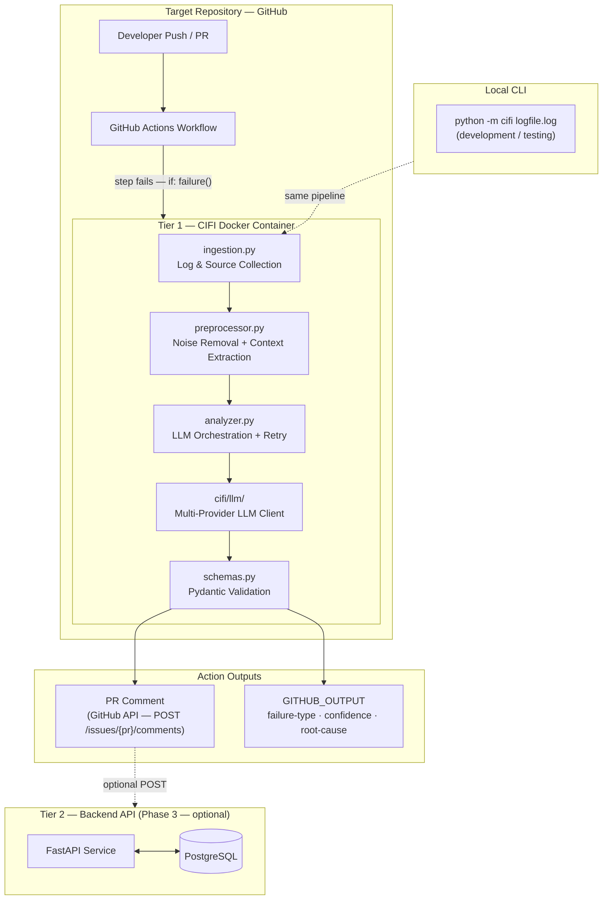
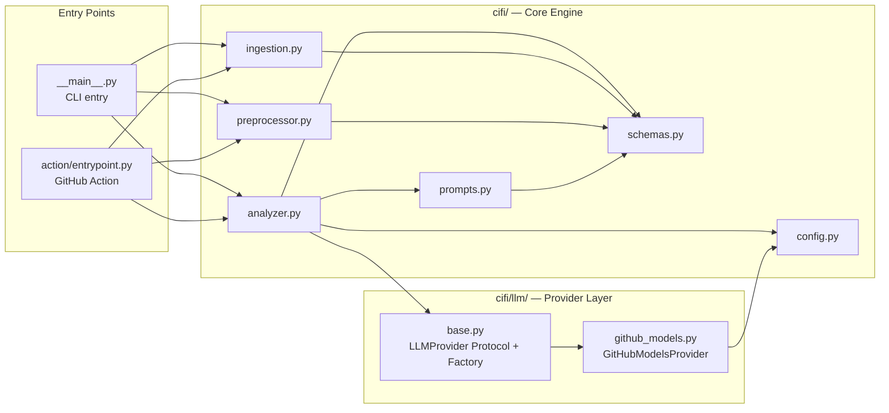

# CIFI — System Architecture

CIFI (CI Failure Intelligence) is an AI-powered CI failure analysis agent. It runs inside GitHub Actions, reads logs and source code directly from the checkout, calls an LLM to analyze the failure, and posts a structured root-cause comment to the PR.

---

## Two-Tier Design

| Tier | What it is | When you need it |
|------|-----------|-----------------|
| **Tier 1 — GitHub Action** | Docker container embedded in target repos. Zero infrastructure. | Always — this is the core product. |
| **Tier 2 — Backend API** *(Phase 3)* | FastAPI + PostgreSQL. Failure history, pattern detection, API key auth. | When you want cross-repo aggregation and dashboards. |

Tier 1 works completely standalone. Tier 2 is an optional enhancement, not a prerequisite.

---

## System Architecture

---

## Python Module Dependency Graph

Every arrow means "imports from". This shows how the modules compose into the pipeline.

---

## Component Summary

| File | Role | Key import/export |
|------|------|-------------------|
| `cifi/schemas.py` | Data contracts — the "language" of the pipeline | `FailureContext`, `RunMetadata`, `ProcessedContext`, `AnalysisResult` |
| `cifi/config.py` | All settings from env vars | `Config.from_env()` |
| `cifi/ingestion.py` | Read logs + source files from disk | `ingest_local()` → `FailureContext` |
| `cifi/preprocessor.py` | Strip noise, extract errors, allocate token budget | `preprocess()` → `ProcessedContext` |
| `cifi/prompts.py` | Build the full LLM prompt | `build_prompt()` → `str` |
| `cifi/analyzer.py` | Orchestrate LLM call + retry + validation | `analyze()` → `AnalysisResult` |
| `cifi/llm/base.py` | `LLMProvider` Protocol + `create_provider()` factory | Provider-agnostic interface |
| `cifi/llm/github_models.py` | GitHub Models REST client | `GitHubModelsProvider` |
| `action/entrypoint.py` | GitHub Action orchestrator + PR comment poster | `run()`, `post_comment()` |
| `cifi/__main__.py` | CLI entry for local testing | `main()` |

---

## Key Design Decisions

- **Protocol-based LLM abstraction** — `LLMProvider` is a `typing.Protocol`, not an ABC. Any object with `async def analyze(self, prompt: str) -> str` is a valid provider. No coupling to base classes.
- **Force JSON from the LLM** — `response_format: {"type": "json_object"}` is passed to every provider that supports it. This eliminates most free-text hallucination.
- **Pydantic validation as a gate** — `AnalysisResult.model_validate_json()` is the only thing that decides if a response is acceptable. Invalid JSON or schema mismatches trigger an exponential-backoff retry.
- **Token budget enforcement** — the preprocessor allocates a fixed percentage of `max_tokens` to each context section, ensuring the prompt never exceeds the LLM context window.
- **Idempotent PR comments** — the entrypoint searches for an existing CIFI comment (via `<!-- cifi-analysis -->` marker) and PATCHes it instead of posting a duplicate.
