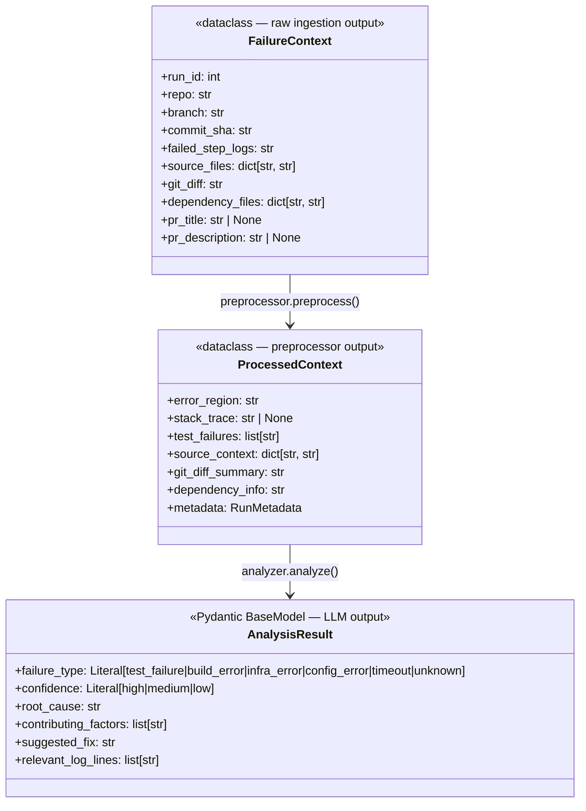
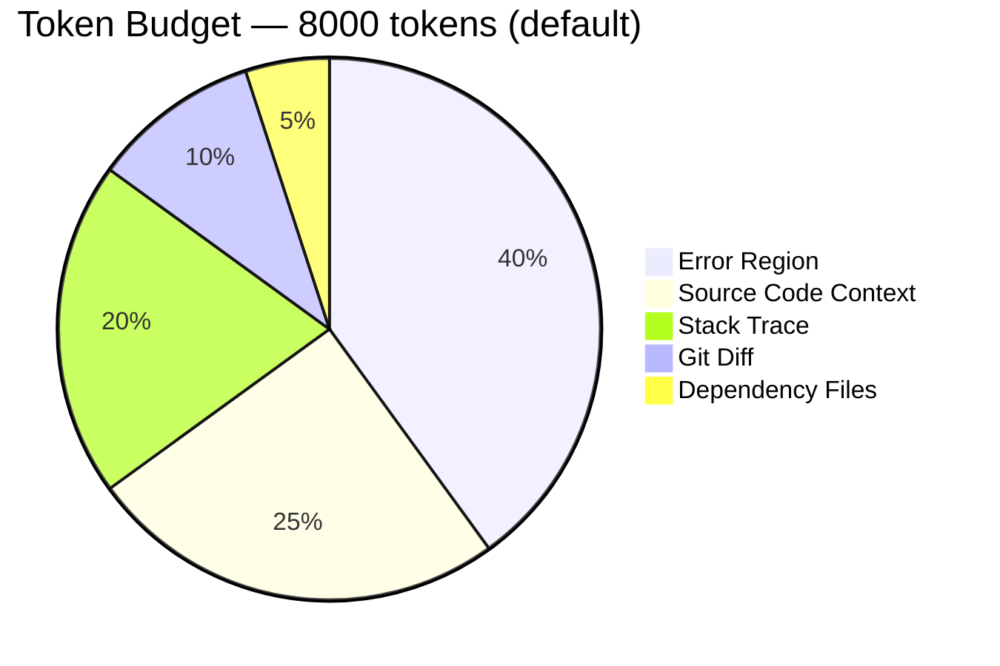
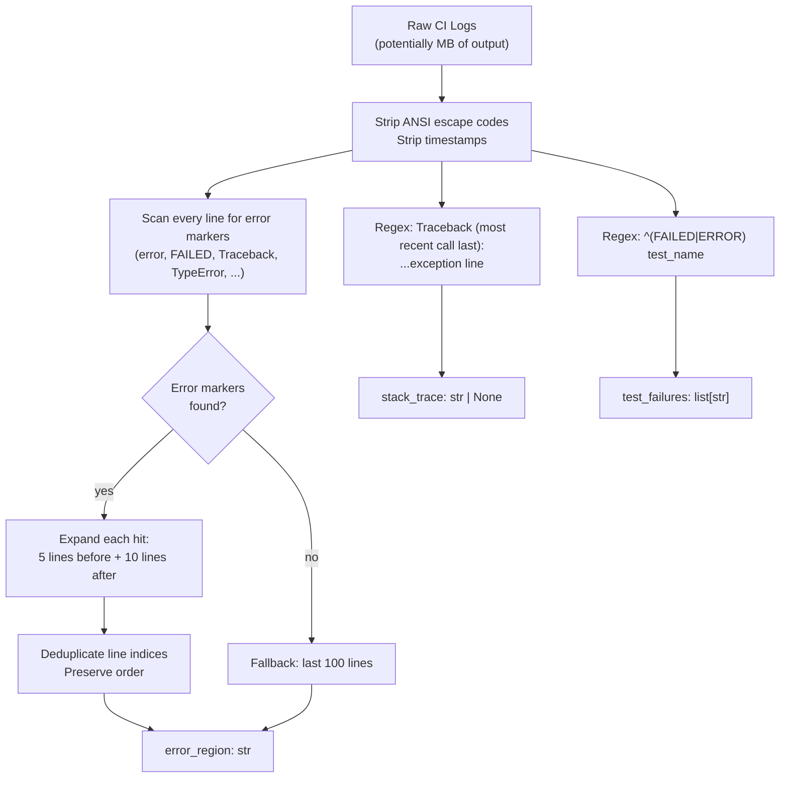

# CIFI — End-to-End Data Flow

This document traces a CI failure from initial trigger through to the posted PR comment, covering every transformation in the pipeline.

---

## Pipeline Overview

```
CI failure
    │
    ▼
ingestion.py  ──→  FailureContext      (raw: logs, source files, git diff, deps)
    │
    ▼
preprocessor.py ──→  ProcessedContext  (cleaned: error region, stack trace, budget-trimmed)
    │
    ▼
prompts.py      ──→  prompt: str       (structured text with system prompt + context sections)
    │
    ▼
analyzer.py     ──→  AnalysisResult   (validated JSON: root cause, fix, confidence)
    │
    ▼
entrypoint.py   ──→  PR Comment       (formatted Markdown posted to GitHub API)
```

---

## Full End-to-End Sequence

```mermaid
sequenceDiagram
    actor Dev as Developer
    participant GHA as GitHub Actions
    participant EP as action/entrypoint.py
    participant Ingest as ingestion.py
    participant Pre as preprocessor.py
    participant Prompt as prompts.py
    participant Anlz as analyzer.py
    participant LLM as GitHub Models API
    participant GHAPI as GitHub API

    Dev->>GHA: Push commit / open PR
    GHA->>GHA: CI workflow runs steps
    GHA->>EP: Step fails — triggers CIFI action

    alt INPUT_LOG_FILE provided
        EP->>EP: Read log file from /github/workspace/
    else run_id + repo + token available
        EP->>GHAPI: GET /repos/{repo}/actions/runs/{id}/jobs
        GHAPI-->>EP: Job list
        EP->>GHAPI: GET /repos/{repo}/actions/jobs/{id}/logs
        GHAPI-->>EP: Raw log content (up to 3 failed jobs)
    else nothing available
        EP->>GHA: Exit 1 with error message
    end

    EP->>Ingest: ingest_local(workspace, step_logs, ...)
    Ingest->>Ingest: Extract file paths from logs (regex)
    Ingest->>Ingest: Read referenced source files from disk
    Ingest->>Ingest: Read dependency files (requirements.txt, pyproject.toml, ...)
    Ingest->>Ingest: git diff HEAD~1
    Ingest->>Ingest: Detect test output markers
    Ingest-->>EP: FailureContext

    EP->>Pre: preprocess(context, max_tokens=8000)
    Pre->>Pre: Strip ANSI escape codes
    Pre->>Pre: Strip timestamps
    Pre->>Pre: Extract error region (plus/minus 5/10 lines around markers)
    Pre->>Pre: Extract Python stack traces (regex)
    Pre->>Pre: Extract pytest FAILED/ERROR lines
    Pre->>Pre: Allocate token budget (40/20/25/10/5 percent)
    Pre->>Pre: Truncate each section to its budget
    Pre-->>EP: ProcessedContext

    EP->>Prompt: build_prompt(processed_context)
    Prompt->>Prompt: Prepend SYSTEM_PROMPT with JSON schema enforcement
    Prompt->>Prompt: Append metadata, error region, stack trace, test failures
    Prompt->>Prompt: Append source code, git diff, dependency info
    Prompt-->>EP: Full prompt string

    EP->>Anlz: analyze(processed_context, config)

    loop Retry loop (up to max_retries, default 3)
        Anlz->>LLM: POST /chat/completions (model, messages, temp=0.2, json_object mode)
        LLM-->>Anlz: Raw JSON string

        Anlz->>Anlz: Strip markdown fences if present
        Anlz->>Anlz: AnalysisResult.model_validate_json(cleaned)

        alt Valid Pydantic schema
            Anlz-->>EP: AnalysisResult
        else Schema error or JSON parse error or LLM error
            Anlz->>Anlz: Log warning, exponential backoff (2^attempt seconds)
        end
    end

    EP->>EP: format_comment(result, model_name)
    EP->>EP: write_outputs to GITHUB_OUTPUT

    alt PR number available from GITHUB_EVENT_PATH
        EP->>GHAPI: GET /repos/{repo}/issues/{pr}/comments
        GHAPI-->>EP: Existing comments

        alt CIFI comment already exists
            EP->>GHAPI: PATCH /repos/{repo}/issues/comments/{id}
        else No existing comment
            EP->>GHAPI: POST /repos/{repo}/issues/{pr}/comments
        end
        GHAPI-->>EP: 200 OK
        EP->>GHA: Print posted analysis to PR
    else No PR number
        EP->>GHA: Print comment to stdout
    end
```



---

## Data Schema Transformations

Each stage transforms one schema into the next. The schemas are the "contracts" between pipeline stages.



---

## Preprocessor: Token Budget Allocation

The preprocessor enforces a hard token budget to prevent prompt overflow. Each context section gets a fixed percentage allocation (default: 8000 tokens total):



**Why this order matters:**
1. **Error Region (40%)** — The first priority. The error output and surrounding log lines are the most informative signal.
2. **Source Code (25%)** — Files referenced in the traceback are read from disk and included. Critical for root-cause analysis that references code logic.
3. **Stack Trace (20%)** — Python tracebacks are extracted separately with a dedicated regex.
4. **Git Diff (10%)** — Recent changes (`git diff HEAD~1`) often reveal what introduced the failure.
5. **Dependency Files (5%)** — `requirements.txt`, `pyproject.toml`, `package.json` etc. catch version conflicts.

Sections that exceed their budget are truncated with a `... [truncated]` marker. This is deterministic — the same input always produces the same truncation.

---

## Error Extraction Logic

The preprocessor does not just take all logs. It surgically extracts the relevant lines:


