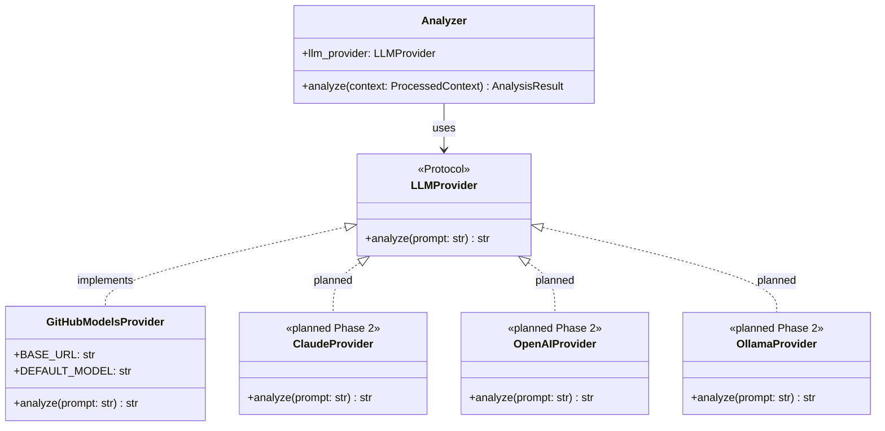
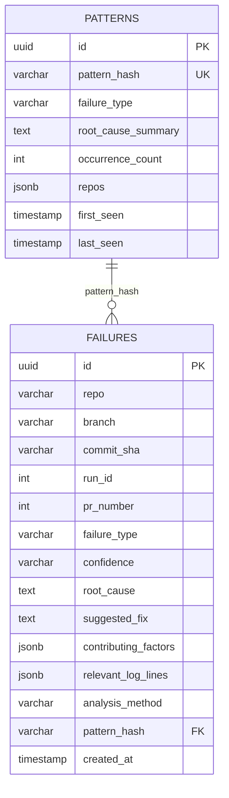
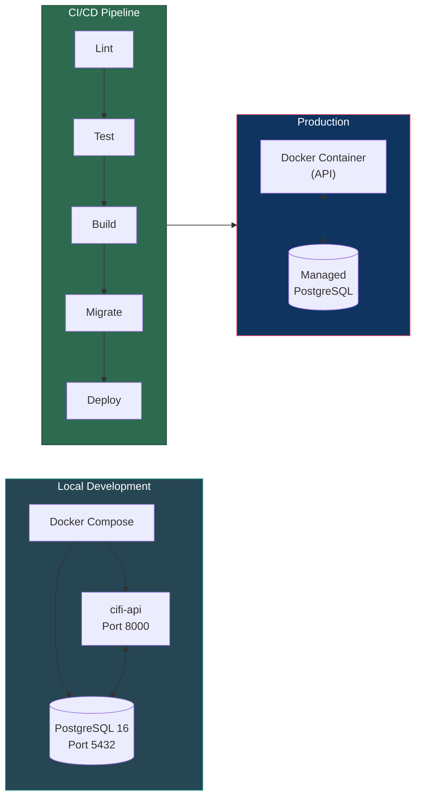

# Detailed Design (DD) — CI Failure Intelligence (CIFI)

## Purpose

This document describes the implementation-level design of each CIFI system component. It complements the HLD by going deeper into interfaces, data flows, and technology choices. The core AI engineering lives in the LLM analyzer and multi-provider LLM integration.

---

## Analysis Pipeline Overview

```mermaid
flowchart TB
    subgraph ingestion["1. Log Ingestion"]
        logs["CI Logs\n(step outputs)"]
        src["Source Code\n($GITHUB_WORKSPACE)"]
        diff["Git Diff\n(HEAD~1)"]
        deps["Dependency Files\n(package.json, requirements.txt)"]
    end

    ingestion --> preprocess

    subgraph preprocess["2. Preprocessor"]
        strip["Strip ANSI / timestamps"]
        detect["Detect error boundaries"]
        extract["Extract stack traces"]
        truncate["Intelligent truncation\n(error > stack > source > diff)"]
        strip --> detect --> extract --> truncate
    end

    preprocess --> analyzer

    subgraph analyzer["3. LLM Analyzer"]
        subgraph llm_call["Multi-Provider LLM"]
            prompt["Build structured prompt"]
            call["Call LLM provider"]
            validate{"Pydantic validation"}
            prompt --> call --> validate
            validate -->|invalid| retry["Retry w/ backoff"]
            retry --> call
        end
    end

    validate -->|valid| output

    subgraph output["4. Output Router"]
        pr["PR Comment\n(GitHub API)"]
        terminal["Terminal\n(local runs)"]
        api["POST to API\n(optional)"]
    end

    style ingestion fill:#264653,stroke:#2a9d8f,color:#fff
    style preprocess fill:#2a9d8f,stroke:#264653,color:#fff
    style analyzer fill:#e76f51,stroke:#264653,color:#fff
    style output fill:#0f3460,stroke:#e94560,color:#fff
```

---

## Tier 1 Components (GitHub Action)

### 1. GitHub Action Entry Point

#### Tech
- `action.yml` — GitHub Action metadata
- `action/entrypoint.py` — Python entry point
- `action/Dockerfile` — Container Action image

#### Responsibilities
- Read CI failure context from the GitHub Actions environment
- Orchestrate the analysis pipeline: ingestion → preprocessing → LLM analysis
- Post results as a PR comment
- Optionally POST results to Tier 2 API

#### Interface — `action.yml`
```yaml
name: 'CI Failure Intelligence'
description: 'AI-powered CI failure analysis — posts structured root cause analysis as PR comments'
inputs:
  github-token:
    description: 'GitHub token for API access and GitHub Models LLM'
    required: true
  log-file:
    description: 'Path to a CI log file inside the workspace (relative path)'
    required: false
    default: ''
  model:
    description: 'GitHub Models model to use'
    required: false
    default: 'openai/gpt-4o-mini'
runs:
  using: docker
  image: docker://ghcr.io/alihaidar2950/cifi:v1
```

#### Entry Point Logic
```python
async def run() -> None:
    # 1. Read environment variables
    token = os.environ.get("INPUT_GITHUB_TOKEN") or os.environ.get("GITHUB_TOKEN", "")
    repo = os.environ.get("GITHUB_REPOSITORY", "")
    workspace = os.environ.get("GITHUB_WORKSPACE", ".")
    model = os.environ.get("INPUT_MODEL", "openai/gpt-4o-mini")

    # 2. Read log content — from log-file input or GitHub Actions API
    log_content = read_log_file(log_file) or await fetch_run_logs(token, repo, run_id)

    # 3. Ingest failure data
    failure_context = ingest_local(
        workspace=workspace,
        step_logs=log_content,
        repo=repo, branch=branch, commit_sha=commit_sha,
    )

    # 4. Preprocess
    processed = preprocess(failure_context, max_tokens=8000)

    # 5. LLM analysis (GitHub Models provider; retry with exponential backoff)
    result = await analyze(processed, config)

    # 6. Post PR comment — idempotent (PATCHes existing CIFI comment if found)
    post_comment(token, repo, pr_number, format_comment(result, model))

    # 7. Write structured outputs to $GITHUB_OUTPUT
    write_outputs(result)
```

---

### 2. Log Ingestion Engine

#### Tech
- Python module: `cifi/ingestion.py`
- Local filesystem access (Tier 1)

#### Responsibilities
- Read CI logs from step output files and `$GITHUB_STEP_SUMMARY`
- Read source code directly from `$GITHUB_WORKSPACE` (full checkout)
- Read git diff via local `git diff HEAD~1`
- Read dependency manifests, config files, test fixtures from workspace

#### Interface
```python
@dataclass
class FailureContext:
    run_id: int
    repo: str
    branch: str
    commit_sha: str
    failed_step_logs: str       # CI logs from failed step
    source_files: dict[str, str]  # relevant source code {path: content}
    git_diff: str               # diff of triggering commit
    dependency_files: dict[str, str]  # package.json, requirements.txt, etc.
    pr_title: str | None
    pr_description: str | None

def ingest_local(
    workspace: str,
    step_logs: str,
    *,
    run_id: int = 0,
    repo: str = "",
    branch: str = "",
    commit_sha: str = "",
    pr_title: str | None = None,
    pr_description: str | None = None,
) -> FailureContext:
    """Tier 1: Read everything from local filesystem."""
    ...
```

#### Source Code Context Strategy
The ingestion engine reads source files intelligently, not the entire repo:
1. Parse error messages for file paths and line numbers
2. Read those specific files from the workspace
3. Read files mentioned in the git diff
4. Read dependency manifests (`package.json`, `requirements.txt`, `pyproject.toml`)
5. Total source context capped at ~4000 tokens to leave room for logs

---

### 3. Preprocessor

#### Tech
- Python module: `cifi/preprocessor.py`
- No external dependencies beyond stdlib + regex

#### Responsibilities
- Strip ANSI escape codes and timestamps from raw logs
- Detect error boundaries (start/end of the actual error region)
- Extract stack traces, assertion failures, error messages
- Truncate intelligently to fit within LLM context window (priority: error region > stack trace > source code > diff)
- Build a structured context object for analysis

#### Interface
```python
@dataclass
class ProcessedContext:
    error_region: str          # The core error output
    stack_trace: str | None    # Extracted stack trace
    test_failures: list[str]   # Individual test failure summaries
    source_context: dict[str, str]  # Relevant source files
    git_diff_summary: str      # Truncated diff
    dependency_info: str       # Relevant dependency context
    metadata: RunMetadata      # repo, branch, commit, PR info

def preprocess(context: FailureContext, max_tokens: int = 8000) -> ProcessedContext:
    ...
```

#### Design Decision
The quality of analysis output is directly proportional to the quality of input. The preprocessor is where most engineering work lives — not the LLM call itself. This is a key AI engineering insight: the preprocessing pipeline matters more than the model choice.

---

### 4. LLM Analyzer

#### Tech
- Python module: `cifi/analyzer.py`
- Multi-provider LLM integration
- Pydantic for output validation

#### Responsibilities
- Send preprocessed context to LLM with structured prompting
- Parse and validate LLM JSON response against output schema
- Retry with exponential backoff on transient LLM failures or validation errors

#### Interface
```python
async def analyze(
    context: ProcessedContext,
    config: Config | None = None,
) -> AnalysisResult:
    """Analyze failure using multi-provider LLM.
    Retries with exponential backoff on validation errors or transient failures.
    """
    config = config or Config.from_env()
    provider = create_provider(config)
    prompt = build_prompt(context)
    # ... retry loop with backoff ...
    result = AnalysisResult.model_validate_json(raw_response)
    return result
```

#### Multi-Provider LLM Architecture



```python
class LLMProvider(Protocol):
    """Provider-agnostic interface for LLM integration."""
    async def analyze(self, prompt: str) -> str: ...

class GitHubModelsProvider(LLMProvider):
    """Free LLM via GitHub Models API. Uses GITHUB_TOKEN. Implemented."""
    BASE_URL = "https://models.github.ai/inference"
    DEFAULT_MODEL = "openai/gpt-4o-mini"

# Planned — Phase 2 (not yet implemented):
# class ClaudeProvider(LLMProvider): ...
# class OpenAIProvider(LLMProvider): ...
# class OllamaProvider(LLMProvider): ...
```

This protocol-based design is a key AI engineering pattern: it decouples the analysis logic from the LLM vendor, making the system extensible and testable.

#### Prompt Engineering
```python
# System prompt — defines role, output format (JSON schema hardcoded, no template vars)
SYSTEM_PROMPT = """\
You are a CI failure analyst. Given pipeline logs, source code context,
a git diff, and test output, identify the root cause of the failure and suggest a fix.

You MUST respond with valid JSON and nothing else. Use exactly this format:

{
  "failure_type": "<test_failure|build_error|infra_error|config_error|timeout|unknown>",
  "confidence": "<high|medium|low>",
  "root_cause": "One sentence describing the root cause",
  "contributing_factors": ["factor 1", "factor 2"],
  "suggested_fix": "Specific actionable fix suggestion",
  "relevant_log_lines": ["relevant line from the logs"]
}

Rules:
- Be specific — reference exact files and line numbers when possible
- Set confidence to "low" if logs are unclear or ambiguous
- Do NOT wrap the JSON in markdown code fences — return raw JSON only"""

# Context window management — intelligent truncation
def build_prompt(context: ProcessedContext, max_tokens: int = 8000) -> str:
    """Build LLM prompt with intelligent context prioritization."""
    # Priority: error region > stack trace > source code > diff
    ...
```

---

### 5. Output Router (Tier 1)

#### Tech
- `action/entrypoint.py` — output handling lives in the Action entry point (no separate module)
- GitHub REST API for PR comments

#### PR Comment Format
```markdown
## 🤖 CIFI — CI Failure Analysis

**Failure Type:** `test_failure` | **Confidence:** `high`

### Root Cause
The `test_user_creation` test fails because the email validation regex was
updated but the test fixture still uses an old format.

### Contributing Factors
- Email regex updated in `validators.py` but tests not updated
- No test for the new regex pattern

### Suggested Fix
Update the test fixture email in `tests/conftest.py` line 42 to use a valid
email format matching the new regex.

### Relevant Log Lines
```
AssertionError: assert 'invalid' == 'valid'
tests/test_users.py::test_user_creation FAILED
```

---
*Analyzed by [CIFI](https://github.com/alihaidar2950/cifi) using GitHub Models (openai/gpt-4o-mini)*
```

---

## Tier 2 — Backend API

### 6. API Service (Phase 3)

#### Tech
- FastAPI application in `backend/`
- PostgreSQL + SQLAlchemy async ORM (`asyncpg`)
- Alembic for database migrations
- API key authentication middleware
- Docker + Docker Compose

#### Responsibilities
- Expose the LLM analyzer as a REST API (on-demand analysis)
- Receive and store analysis results from Tier 1 Actions
- Persist failure history in PostgreSQL
- Detect recurring failure patterns via hash-based matching
- Serve paginated, filterable failure history

#### Endpoints
```python
# Analysis
@router.post("/api/analyze")
async def analyze_logs(payload: AnalyzeRequest, db: AsyncSession) -> AnalysisResult:
    """Run LLM analyzer, store result, return analysis."""
    context = preprocess(payload.logs, payload.source_files)
    result = await analyze(context)
    await store_failure(db, result, payload.metadata)
    await check_patterns(db, result)
    return result

# Failure History
@router.get("/api/failures")
async def list_failures(
    db: AsyncSession,
    repo: str | None = None,
    branch: str | None = None,
    failure_type: str | None = None,
    since: datetime | None = None,
    page: int = 1,
    per_page: int = 20,
) -> PaginatedResponse[FailureSummary]:
    """List stored failures with pagination and filtering."""
    ...

@router.get("/api/failures/{failure_id}")
async def get_failure(failure_id: uuid.UUID, db: AsyncSession) -> FailureDetail:
    """Get full failure detail including analysis result."""
    ...

# Pattern Detection
@router.get("/api/patterns")
async def list_patterns(
    db: AsyncSession,
    repo: str | None = None,
    min_occurrences: int = 3,
) -> list[PatternSummary]:
    """List recurring failure patterns."""
    ...

# Health
@router.get("/api/health")
async def health(db: AsyncSession) -> dict:
    """Health check with DB connectivity status."""
    ...
```

#### Authentication Middleware
```python
async def verify_api_key(request: Request) -> None:
    """API key auth middleware. Key passed via X-API-Key header."""
    api_key = request.headers.get("X-API-Key")
    if not api_key or not verify(api_key):
        raise HTTPException(status_code=401, detail="Invalid API key")
```

---

### 8. Database Models + Pattern Detection

#### Tech
- SQLAlchemy 2.0 async ORM
- Alembic for schema migrations
- PostgreSQL

#### Database Schema



```python
class Failure(Base):
    __tablename__ = "failures"

    id: Mapped[uuid.UUID] = mapped_column(primary_key=True, default=uuid.uuid4)
    repo: Mapped[str] = mapped_column(String(255), index=True)
    branch: Mapped[str] = mapped_column(String(255))
    commit_sha: Mapped[str] = mapped_column(String(40))
    run_id: Mapped[int | None]
    pr_number: Mapped[int | None]
    failure_type: Mapped[str] = mapped_column(String(50), index=True)
    confidence: Mapped[str] = mapped_column(String(10))
    root_cause: Mapped[str] = mapped_column(Text)
    suggested_fix: Mapped[str] = mapped_column(Text)
    contributing_factors: Mapped[list[str]] = mapped_column(JSONB)
    relevant_log_lines: Mapped[list[str]] = mapped_column(JSONB)
    analysis_method: Mapped[str] = mapped_column(String(20))  # llm provider used
    pattern_hash: Mapped[str] = mapped_column(String(64), index=True)  # SHA-256
    created_at: Mapped[datetime] = mapped_column(default=func.now(), index=True)

class Pattern(Base):
    __tablename__ = "patterns"

    id: Mapped[uuid.UUID] = mapped_column(primary_key=True, default=uuid.uuid4)
    pattern_hash: Mapped[str] = mapped_column(String(64), unique=True)
    failure_type: Mapped[str] = mapped_column(String(50))
    root_cause_summary: Mapped[str] = mapped_column(Text)
    occurrence_count: Mapped[int] = mapped_column(default=1)
    repos: Mapped[list[str]] = mapped_column(JSONB)  # repos where this pattern appears
    first_seen: Mapped[datetime] = mapped_column(default=func.now())
    last_seen: Mapped[datetime] = mapped_column(default=func.now())
```

#### Pattern Detection Logic
```python
def compute_pattern_hash(root_cause: str, failure_type: str) -> str:
    """Deterministic hash for failure pattern matching."""
    normalized = normalize_error(root_cause)  # strip line numbers, paths, etc.
    return hashlib.sha256(f"{normalized}:{failure_type}".encode()).hexdigest()

async def check_patterns(db: AsyncSession, result: AnalysisResult, repo: str) -> None:
    """Update or create pattern record. Flag when occurrence_count >= 3."""
    pattern_hash = compute_pattern_hash(result.root_cause, result.failure_type)
    existing = await db.execute(
        select(Pattern).where(Pattern.pattern_hash == pattern_hash)
    )
    pattern = existing.scalar_one_or_none()
    if pattern:
        pattern.occurrence_count += 1
        pattern.last_seen = func.now()
        if repo not in pattern.repos:
            pattern.repos = [*pattern.repos, repo]
    else:
        db.add(Pattern(
            pattern_hash=pattern_hash,
            failure_type=result.failure_type,
            root_cause_summary=result.root_cause,
            repos=[repo],
        ))
    await db.commit()
```

#### Deployment



---

## Deferred Component Designs (Future)

The following are documented for future reference. They are not part of the current build plan.

<details>
<summary>Click to expand deferred component designs</summary>

### Deep Infrastructure (EKS + Terraform)
If targeting platform/infra roles specifically:
- Terraform modules: VPC/subnets, EKS cluster, ECR, RDS
- Kustomize overlays: base + dev/prod
- Prometheus + Grafana observability
- HPA, Sealed Secrets, IAM policies

### Web Dashboard
- React frontend: recent failures, recurring patterns, per-repo failure rate chart, failure detail view

### MCP Server
- `analyze_failure(run_id)`, `get_failure_history(repo, days)`, `get_recurring_patterns(repo)`, `get_fix_suggestions(run_id)`

### CLI Tool
- `cifi history <repo>`, `cifi patterns <repo>`, `cifi status` — Python + typer

### Slack Integration
- Failure summaries posted to Slack channels via incoming webhook

</details>

---

## Configuration & Environment Variables

### Tier 1 (GitHub Action Inputs)
| Input | Purpose | Default |
|---|---|---|
| `github-token` | GitHub API access + GitHub Models LLM | (required) |
| `log-file` | Path to a CI log file inside the workspace | `""` (fetches via API if omitted) |
| `model` | GitHub Models model to use | `openai/gpt-4o-mini` |

### Tier 2 API (Environment Variables)
| Variable | Purpose | Default |
|---|---|---|
| `CIFI_LLM_PROVIDER` | LLM provider for on-demand analysis | `github-models` |
| `CIFI_LLM_API_KEY` | API key for LLM provider | (optional) |
| `DATABASE_URL` | PostgreSQL connection string | `postgresql+asyncpg://...` |
| `CIFI_API_KEY` | API key for authenticating clients | (required) |

All secrets via env vars or GitHub Actions secrets. Never hardcoded.
