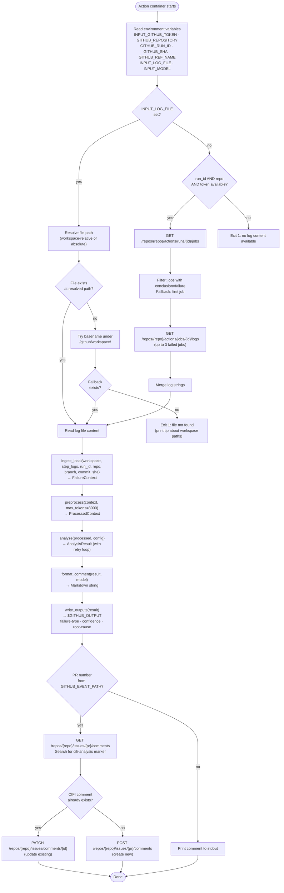
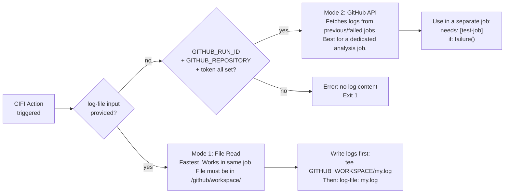
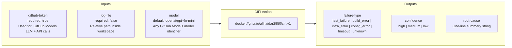
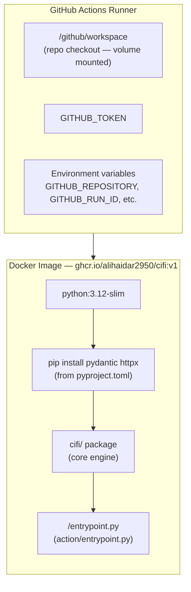

# CIFI — GitHub Action Workflow

This document covers how the CIFI GitHub Action works: the Docker container lifecycle, the execution flow inside `action/entrypoint.py`, how logs are acquired, and how to integrate it into a workflow.

---

## Action Execution Flow



---

## Log Acquisition Decision Tree

There are two ways CIFI gets log content, chosen automatically:



**Mode 1 (log-file)** is simpler and works in the same job. The step that fails must write its output to a file first:
```yaml
- name: Run tests
  run: pytest 2>&1 | tee $GITHUB_WORKSPACE/test-output.log
  continue-on-error: true

- uses: alihaidar2950/cifi@v1
  if: failure()
  with:
    github-token: ${{ secrets.GITHUB_TOKEN }}
    log-file: test-output.log
```

**Mode 2 (API)** works across jobs. CIFI runs in its own job after the failing job:
```yaml
jobs:
  test:
    runs-on: ubuntu-latest
    steps:
      - run: pytest

  analyze:
    needs: test
    if: failure()
    runs-on: ubuntu-latest
    steps:
      - uses: alihaidar2950/cifi@v1
        with:
          github-token: ${{ secrets.GITHUB_TOKEN }}
```

---

## action.yml — Inputs & Outputs



### Full action.yml

```yaml
name: CI Failure Intelligence
description: AI-powered CI failure analysis — posts structured root cause analysis as PR comments

inputs:
  github-token:
    description: GitHub token for API access and GitHub Models LLM
    required: true
  log-file:
    description: Path to a CI log file inside the workspace (relative path)
    required: false
    default: ""
  model:
    description: GitHub Models model to use
    required: false
    default: "openai/gpt-4o-mini"

outputs:
  failure-type:
    description: test_failure | build_error | infra_error | config_error | timeout | unknown
  confidence:
    description: high | medium | low
  root-cause:
    description: Root cause summary

runs:
  using: docker
  image: docker://ghcr.io/alihaidar2950/cifi:v1
  env:
    INPUT_GITHUB_TOKEN: ${{ inputs.github-token }}
    INPUT_LOG_FILE: ${{ inputs.log-file }}
    INPUT_MODEL: ${{ inputs.model }}
```

---

## Docker Container Architecture



**Two-stage build** in the Dockerfile:
1. Copy `pyproject.toml` + stub `cifi/__init__.py` → `pip install` (resolves deps only; cached layer)
2. Copy real `cifi/` source → `pip install --no-deps` (installs package without re-downloading)

This keeps the image layer cache efficient — rebuilds only reinstall deps when `pyproject.toml` changes.

---

## PR Comment Format

The posted comment is idempotent. CIFI checks for a hidden HTML comment marker (`<!-- cifi-analysis -->`) and PATCHes the existing comment rather than creating a new one on re-runs.

```
<!-- cifi-analysis -->
## 🤖 CIFI — CI Failure Analysis

**Failure Type:** `test_failure` | **Confidence:** `high`

### Root Cause
AssertionError in tests/test_math.py:15 — expected 4 but got 5

### Contributing Factors
- Off-by-one error in add() function
- Missing edge case for negative numbers

### Suggested Fix
Change `return a + b + 1` to `return a + b` in math_utils.py line 3

### Relevant Log Lines
```
FAILED tests/test_math.py::test_add - AssertionError: assert 5 == 4
```

---
*Analyzed by CIFI using GitHub Models (openai/gpt-4o-mini)*
```

---

## Minimal Integration (3 lines)

```yaml
- uses: alihaidar2950/cifi@v1
  if: failure()
  with:
    github-token: ${{ secrets.GITHUB_TOKEN }}
```

Add this as the last step in any job. When any preceding step fails, CIFI activates, analyzes the failure, and posts a comment to the PR.

---

## Using Outputs in Downstream Steps

```yaml
- uses: alihaidar2950/cifi@v1
  id: cifi
  if: failure()
  with:
    github-token: ${{ secrets.GITHUB_TOKEN }}

- name: Check analysis result
  if: failure()
  run: |
    echo "Failure type: ${{ steps.cifi.outputs.failure-type }}"
    echo "Confidence: ${{ steps.cifi.outputs.confidence }}"
    echo "Root cause: ${{ steps.cifi.outputs.root-cause }}"
```

The three outputs (`failure-type`, `confidence`, `root-cause`) are written to `$GITHUB_OUTPUT` and available as step outputs for conditional logic, notifications, or further automation.
