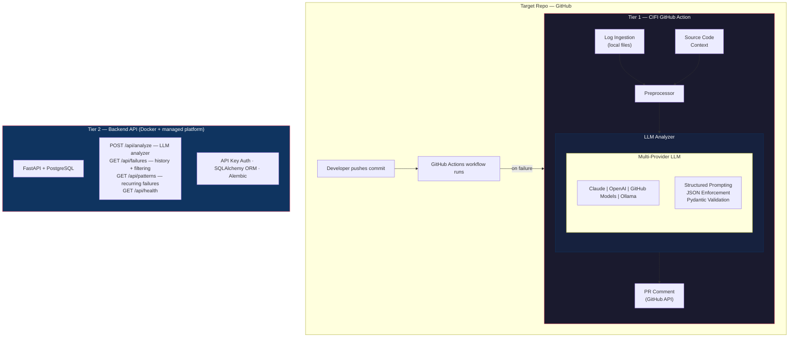
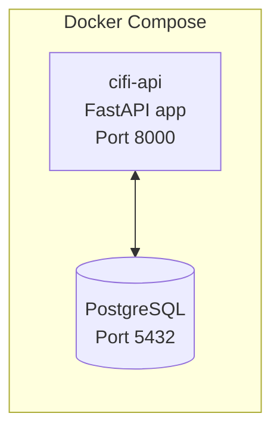
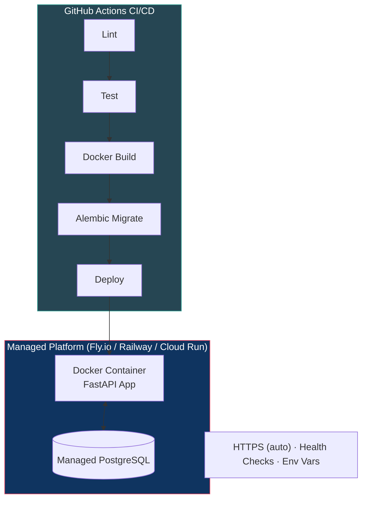
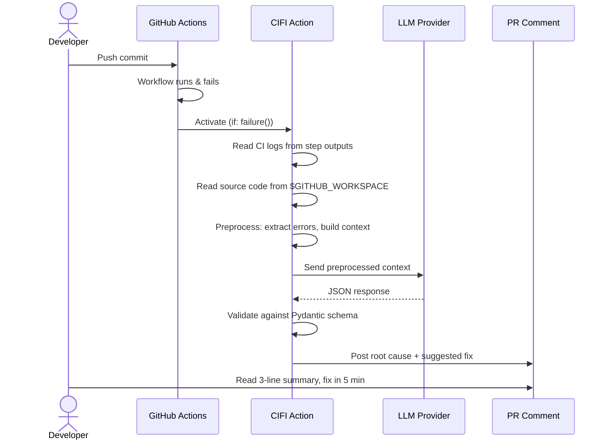
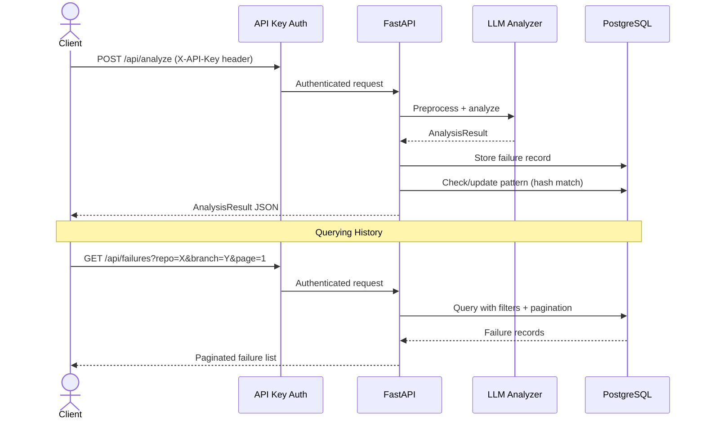

# High-Level Design — CI Failure Intelligence (CIFI)

## System Overview

CIFI is an **AI-powered CI failure analysis agent** built on a two-tier architecture with a **multi-provider LLM analysis core**:

- **Tier 1 — GitHub Action** (embedded in target repos): Runs inside the CI pipeline itself, has full access to source code, logs, and test output. Performs LLM analysis (multi-provider, structured prompting, Pydantic validation) and posts results as PR comments. Zero infrastructure required — just add the Action to your workflow.
- **Tier 2 — Backend API** (optional, deployed via Docker): A real FastAPI backend with PostgreSQL persistence, API key auth, failure history, and pattern detection. Receives results from Tier 1 Actions, stores them, detects recurring patterns, and exposes a RESTful API.

The core AI engineering is in the **LLM analysis engine**: a multi-provider architecture (Claude, OpenAI, GitHub Models, Ollama) with structured prompting, JSON enforcement, and Pydantic validation for production-grade output. The backend engineering is in **Tier 2**: a production-grade API with database persistence, authentication, and algorithmic pattern detection.

---

## Architecture Diagram



---

## Tier 1 — GitHub Action (Embedded Analysis)

### What It Does
Runs as a step in the target repo's GitHub Actions workflow. When a preceding step fails, CIFI activates, reads logs and source code directly from the checkout, analyzes the failure using the LLM analysis engine, and posts a PR comment with the root cause and suggested fix.

### Why Embedded
The critical insight: a webhook-based server can only access what the GitHub API exposes — logs, diffs, and PR metadata. It cannot see the full source code, dependency files, test fixtures, or configuration that often hold the real root cause. By running inside the CI pipeline, CIFI has the full checkout at its disposal.

### How It Works
1. The Action reads CI logs from the `log-file` input (a workspace-relative file path) or fetches failed job logs via the GitHub Actions API
2. Log ingestion reads source code directly from the workspace (`$GITHUB_WORKSPACE`)
3. Preprocessor strips noise, extracts error regions, builds structured context
4. Multi-provider LLM analyzes the preprocessed context with structured prompting
5. LLM response validated against Pydantic schema — malformed responses retried
6. Posts structured analysis as a PR comment via GitHub API (idempotent — PATCHes an existing CIFI comment if present)

### Usage (3 lines in a workflow)
```yaml
- uses: alihaidar2950/cifi@v1
  if: failure()
  with:
    github-token: ${{ secrets.GITHUB_TOKEN }}
```

### Context Available in Tier 1
| Context | How Accessed | Value |
|---|---|---|
| CI logs | `$GITHUB_STEP_SUMMARY`, step output files | Primary error source |
| Source code | `$GITHUB_WORKSPACE` (checkout) | Full codebase context |
| Dependency files | `package.json`, `requirements.txt`, etc. from checkout | Dependency issues |
| Test fixtures | Direct file read from workspace | Test data context |
| Git diff | `git diff HEAD~1` locally | What changed |
| Config files | `.env.example`, `tsconfig.json`, etc. | Configuration context |

---

## Tier 2 — Backend API

### What It Does
A real FastAPI backend service with PostgreSQL persistence. Receives analysis results from Tier 1 Actions (or runs on-demand analysis), stores failure history, detects recurring patterns across repos, and exposes a RESTful API with pagination, filtering, and authentication.

### Why a Real Backend
A health-check-only API proves nothing. A backend with database persistence, authentication, query filtering, and pattern detection demonstrates real backend engineering: database design, ORM usage, migration management, API design, auth middleware, and async Python.

### Components
1. **FastAPI API** — RESTful endpoints: analyze, list failures, get failure detail, list patterns, health check
2. **PostgreSQL** — Failure history storage, pattern tracking
3. **SQLAlchemy ORM** — Async ORM with `asyncpg`, proper model design
4. **Alembic** — Database schema migrations
5. **API Key Auth** — Middleware-based authentication for all endpoints
6. **Pattern Detection** — Hash-based recurring failure identification (SHA-256 of normalized error + failure type)
7. **Docker** — Multi-stage Dockerfile, Docker Compose for local dev (API + PostgreSQL)
8. **CI/CD** — GitHub Actions: test → build → migrate → deploy

### Deferred Components
These are separate projects:
- Deep infrastructure (EKS, Terraform, Kustomize, Prometheus/Grafana)
- React web dashboard
- MCP server for AI agent integration
- CLI tool, Slack integration

---

## LLM Analysis — The Core Architecture

This is the heart of CIFI and the primary AI engineering showcase. The multi-provider LLM architecture demonstrates production-grade AI system design, not just "wrap an LLM API."

### Multi-Provider LLM Integration
CIFI sends preprocessed context to an LLM via a provider-agnostic architecture:

- **GitHub Models API** — Free via `GITHUB_TOKEN`. The sole implemented provider in Phase 1.
- **Claude API** — Higher quality, pay-per-use. *(Planned — Phase 2)*
- **OpenAI-compatible** — Any OpenAI-compatible endpoint. *(Planned — Phase 2)*
- **Ollama** — Self-hosted, for teams that can't send logs externally. *(Planned — Phase 2)*

Each provider implements a shared Python protocol, making the system extensible. Adding a new LLM provider requires implementing a single method.

### Structured Prompting + Output Validation
- System prompt with role definition, output format specification, and domain context
- User prompt with preprocessed logs, source code, diff, and metadata
- JSON output enforcement — the LLM must respond in valid JSON
- Pydantic schema validation — every response is validated before use
- Retry with exponential backoff on validation failures
- Few-shot examples for edge cases

### Why LLM-Powered
| Approach | Speed | Cost | Accuracy | Coverage |
|---|---|---|---|---|
| **Multi-Provider LLM** | **3-10s** | **Free via GitHub Models** | **High** | **~95% of failures** |

By using GitHub Models API (free via `GITHUB_TOKEN`), CIFI provides high-quality analysis at zero cost for most users. Teams that need higher quality can switch to Claude or OpenAI. Teams with privacy requirements can use Ollama for fully local analysis.

### AI Engineering Decisions
| Decision | Rationale |
|---|---|
| Provider-agnostic design | Protocol-based abstraction. Not locked to any vendor. |
| Pydantic validation | Production-grade output handling. Malformed responses are caught and retried. |
| Structured prompting | Explicit JSON format, role definitions, context prioritization. Not "summarize this log." |
| Context window management | Intelligent truncation: error region > stack trace > source > diff. Maximizes signal per token. |
| GitHub Models as default | Free LLM access via existing `GITHUB_TOKEN`. Zero-config for users. |

---

## Component Breakdown

### 1. Log Ingestion (Tier 1)
Reads failure context directly from the local CI environment:
- CI logs from step output / log files
- Source code from the checked-out workspace
- Git diff via local `git` commands
- Dependency manifests from the filesystem

### 2. Preprocessor (Tier 1)
Cleans and structures raw data before analysis:
- Strip ANSI escape codes and timestamps
- Detect error boundaries (start/end of error region)
- Extract stack traces, assertion failures, error messages
- Truncate intelligently to fit within LLM context window (priority: error region > stack trace > source code > diff)
- Build structured context object
- **Key insight**: The quality of AI analysis is directly proportional to preprocessing quality. This is where most engineering work lives.

### 3. LLM Analyzer (Tier 1)
Multi-provider LLM analysis engine:
- Python protocol class defining the provider interface
- Individual implementations: Claude, OpenAI, GitHub Models, Ollama
- Structured system prompt + preprocessed context
- Force JSON output, validate against Pydantic schema
- Retry with backoff on transient failures

### 4. Output Router (Tier 1)
Delivers analysis results:
- **PR Comment** (Tier 1): Markdown summary posted via GitHub API
- **Terminal** (local): Rich terminal output for local runs
- **Tier 2 API** (optional): POSTs result to backend for storage and pattern tracking

### 5. Backend API (Phase 3)
FastAPI service with PostgreSQL:
- `POST /api/analyze` — accepts log payload, runs LLM analyzer, stores result, returns analysis
- `GET /api/failures` — list stored failures with pagination + filtering (repo, branch, date range)
- `GET /api/failures/{id}` — single failure detail
- `GET /api/patterns` — recurring failure patterns (hash-based detection)
- `GET /api/health` — health check with DB connectivity status
- API key authentication middleware
- SQLAlchemy async ORM + Alembic migrations
- Structured JSON logging with request IDs

---

## Infrastructure Design

### Tier 1 (No Infrastructure)
The GitHub Action runs in GitHub's hosted runners. No infrastructure to manage. Users add 3 lines to their workflow file.

### Tier 2 — Local Development



### Tier 2 — Production



No VPCs, no EKS clusters, no Terraform modules. Deploy simply — the AI engine and backend design are the product.

---

## Data Flow — End to End

### Tier 1 (Standalone — Primary Use Case)



### Tier 2 API (On-Demand Analysis + Persistence)



---

## Security Considerations

- `GITHUB_TOKEN` is the only required secret for Tier 1 — provided automatically by GitHub Actions
- LLM API keys (if using paid providers) stored as GitHub Actions secrets
- Logs may contain sensitive data — scrubbing layer before sending to external LLM APIs
- Ollama provider available for fully local analysis — no data leaves the runner
- API key authentication for Tier 2 endpoints
- Input validation on all API endpoints
- Rate limiting on analysis endpoints

---

## Key Design Decisions — Summary

| Decision | Choice | Rationale |
|---|---|---|
| **LLM-powered analysis** | Multi-provider LLM with structured prompting | Production-grade AI analysis with provider abstraction and output validation. |
| **Multi-provider LLM** | Protocol-based abstraction | Vendor-agnostic, extensible, real AI engineering pattern |
| **Structured prompting** | JSON enforcement + Pydantic | Production-grade LLM integration, not notebook demos |
| **Embedded in CI** | GitHub Action, not webhook | Solves the context problem — full checkout access |
| **Simple deployment** | Docker + managed platform | Deploy simply. The AI engine and backend design are the product. |
| **Two-tier architecture** | Action + optional backend API | GitHub Action for CI, backend API for history/patterns/on-demand. |
| **Force JSON from LLM** | Yes | Reliable parsing; no prompt-output ambiguity |
| **Pattern detection** | Hash-based, not LLM-based | Fast, cheap, deterministic |
| **PostgreSQL persistence** | Real database, not in-memory | Backend engineering signal: schema design, migrations, ORM |
