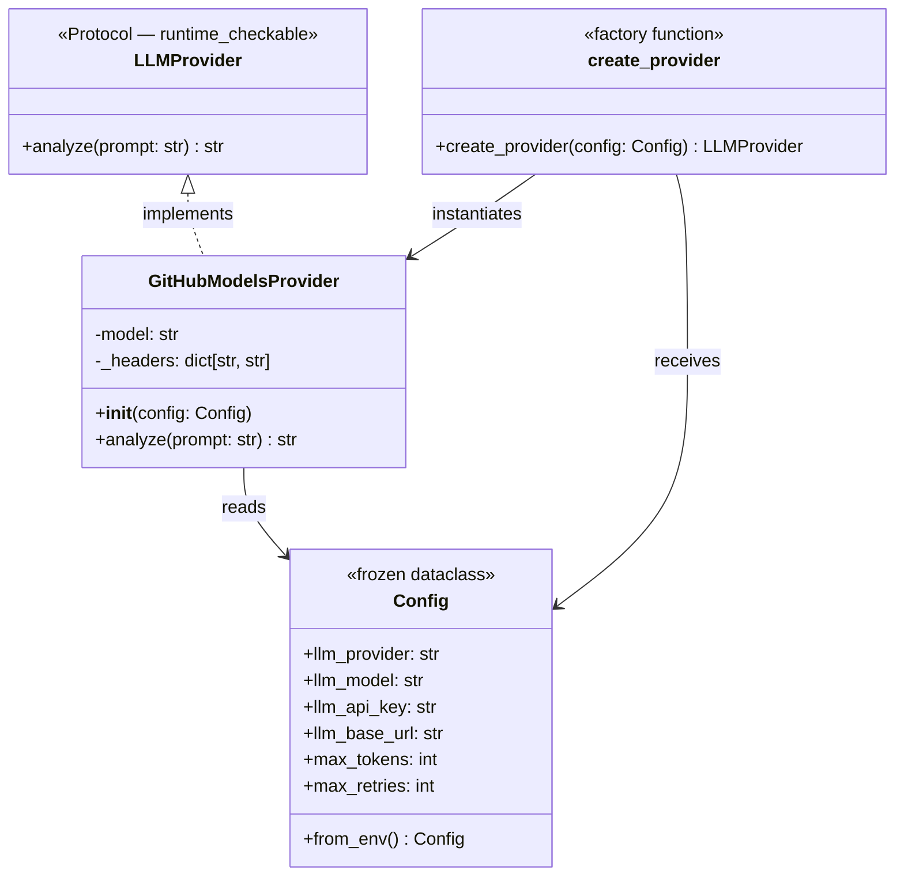
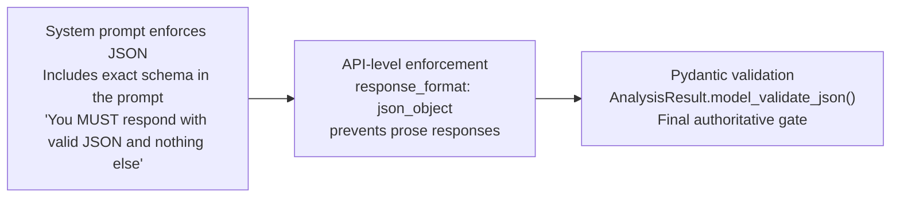

# CIFI — Multi-Provider LLM Integration

CIFI uses a **provider-agnostic LLM layer** based on Python's `typing.Protocol`. Any object that implements the `LLMProvider` protocol can be dropped in without changing the rest of the pipeline.

---

## Architecture Overview



---

## analyze() — Call Flow

```mermaid
flowchart TD
    cfg["Config.from_env()\nReads CIFI_LLM_PROVIDER"] --> factory["create_provider(config)"]

    factory --> match{config.llm_provider}

    match -->|"github-models"| gh["GitHubModelsProvider(config)\nFree via GITHUB_TOKEN"]
    match -->|"other"| err["ValueError: Unknown provider"]

    gh --> prompt_build["build_prompt(context)\nAssemble prompt from ProcessedContext"]
    prompt_build --> call["provider.analyze(prompt)\nasync — returns raw str"]
    call --> strip["Strip markdown fences\nif LLM wrapped JSON in backticks"]
    strip --> validate["AnalysisResult.model_validate_json(cleaned)\nPydantic validates schema"]

    validate --> ok{Valid?}
    ok -->|yes| result["Return AnalysisResult"]
    ok -->|no| retry["Increment attempt\nExponential backoff 2^n seconds"]
    retry --> exhausted{attempts >= max_retries?}
    exhausted -->|no| call
    exhausted -->|yes| raise["Raise AnalysisError"]
```

---

## Current Provider: GitHub Models

`GitHubModelsProvider` calls the [GitHub Models API](https://docs.github.com/en/github-models) — free LLM access using the same `GITHUB_TOKEN` already available in every Actions workflow.

### HTTP Request

```
POST https://models.github.ai/inference/chat/completions
Authorization: Bearer {GITHUB_TOKEN}
Accept: application/vnd.github+json
X-GitHub-Api-Version: 2026-03-10
Content-Type: application/json

{
  "model": "openai/gpt-4o-mini",
  "messages": [{"role": "user", "content": "<full prompt>"}],
  "temperature": 0.2,
  "response_format": {"type": "json_object"}
}
```

**Key settings:**
- `temperature: 0.2` — low randomness for deterministic structured output
- `response_format: json_object` — instructs the model to return only valid JSON (no prose wrapping)
- Default model: `openai/gpt-4o-mini` — fast, cheap, good at structured output

### Configuration via Environment Variables

| Variable | Default | Description |
|----------|---------|-------------|
| `CIFI_LLM_PROVIDER` | `github-models` | Which provider to use |
| `CIFI_LLM_MODEL` | `openai/gpt-4o-mini` | Model identifier |
| `CIFI_LLM_API_KEY` | *(empty)* | API key — falls back to `GITHUB_TOKEN` |
| `CIFI_LLM_BASE_URL` | *(empty)* | Custom base URL (for self-hosted providers) |
| `CIFI_MAX_TOKENS` | `8000` | Token budget for preprocessor |
| `CIFI_MAX_RETRIES` | `3` | LLM call retry limit |

---

## JSON Enforcement Strategy

CIFI uses a two-layer strategy to guarantee structured output:



1. **Prompt-level**: The system prompt includes the exact JSON schema and explicitly forbids prose or markdown fences.
2. **API-level**: `response_format: {"type": "json_object"}` is set on providers that support it, which prevents the model from producing non-JSON output.
3. **Pydantic-level**: `AnalysisResult.model_validate_json()` is the final gate. If it raises, the attempt is retried. This catches schema drift, missing fields, and wrong enum values.

---

## LLM Response Schema

The LLM is always expected to return exactly this JSON structure:

```json
{
  "failure_type": "test_failure | build_error | infra_error | config_error | timeout | unknown",
  "confidence": "high | medium | low",
  "root_cause": "One sentence describing the root cause",
  "contributing_factors": ["factor 1", "factor 2"],
  "suggested_fix": "Specific actionable fix suggestion",
  "relevant_log_lines": ["relevant line from the logs"]
}
```

This schema is both embedded in the system prompt (so the LLM knows what to produce) and defined as a `pydantic.BaseModel` (so the output is validated). The prompt and the schema are always kept in sync.

---

## Adding a New Provider

To add a new LLM provider (e.g. Claude, OpenAI direct, Ollama):

1. **Create** `cifi/llm/your_provider.py` with a class that has `async def analyze(self, prompt: str) -> str`.
2. **Add a case** in `create_provider()` in `cifi/llm/base.py`:
   ```python
   case "your-provider":
       from cifi.llm.your_provider import YourProvider
       return YourProvider(config)
   ```
3. **Set the env var** `CIFI_LLM_PROVIDER=your-provider` when running.

No other changes are required — the rest of the pipeline is provider-agnostic.

### Provider Checklist

- [ ] `analyze()` must be `async`
- [ ] Must return a raw JSON string (strip any wrapping if necessary)
- [ ] Should honor `config.llm_model` for model selection
- [ ] Should use `config.llm_api_key` for authentication
- [ ] Should set temperature low (0.1–0.3) for deterministic structured output
- [ ] Should request JSON output mode if the provider supports it
