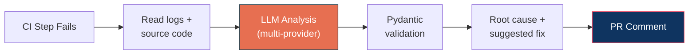
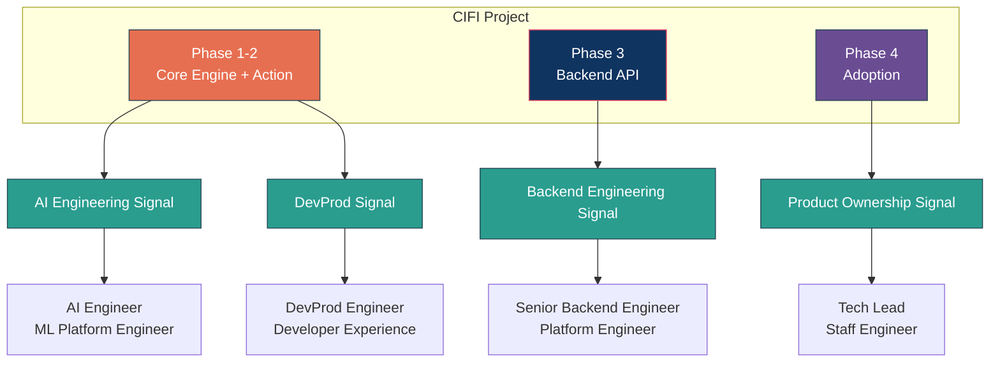
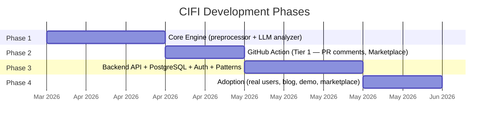

# North Star — CI Failure Intelligence (CIFI)

## Vision

Build an AI-powered CI failure analysis agent that lives inside your GitHub Actions workflow — add 3 lines, get instant root cause analysis on every failure. No infrastructure. No configuration. No log triage.

The core innovation is a **multi-provider LLM analysis engine**: provider-agnostic architecture for multi-provider LLM intelligence, structured prompting for reliability, and Pydantic validation for production-grade output. This is AI engineering applied to a real developer problem.

---

## The Problem Worth Solving

Every engineer who runs CI pipelines knows this loop:

1. Pipeline fails
2. Engineer opens logs — 3,000 lines of noise
3. Engineer searches for the actual error buried in the middle
4. Engineer context-switches, loses flow, spends 20–40 minutes triaging
5. The fix takes 5 minutes. The diagnosis took 40.

This happens dozens of times per day across any engineering team. It is solved nowhere well. It is ripe for automation — and for AI.

---

## What CIFI Does

CIFI runs **inside** your CI pipeline as a GitHub Action. When a step fails, it:

- Reads the CI logs and source code directly from the checkout (full repo context)
- Analyzes failures using multi-provider LLM (GitHub Models API — free with `GITHUB_TOKEN`, plus Claude / OpenAI / Ollama)
- Validates all LLM output against Pydantic schemas — no unstructured text
- Posts a structured root cause summary + suggested fix as a PR comment

Engineers stop triaging logs. They read a three-line summary and fix the issue.

### The Key Insight
By running inside the CI pipeline (not as an external webhook receiver), CIFI has the full checkout — source code, dependencies, config files, test fixtures. This solves the context problem that limits external CI analysis tools.

---

## Why This Project — Career Context

This project exists to solve a real problem **and** to demonstrate AI engineering depth.

| Career Goal | How CIFI Serves It |
|---|---|
| Demonstrate AI engineering skills | Multi-provider LLM integration, structured prompting, output validation, provider abstraction |
| Show production-grade AI systems | Not a notebook demo — provider abstraction, retry logic, schema enforcement |
| Demonstrate backend engineering | Real API with PostgreSQL, SQLAlchemy, Alembic migrations, API key auth, pagination, filtering |
| Escape QA/embedded framing | AI-powered developer tool with a real backend, not test execution |
| Ship a real product | GitHub Marketplace Action with real users and real value |
| GitHub Actions expertise | Custom Action published to marketplace |
| Public proof of skills | Fully open-source, demoable, yours to own in interviews |
| Target Backend / AI / DevProd roles | AI engine + real backend service + developer tool = multiple role signals |
| Progressive architecture | LLM analysis → GitHub Action → Backend API → real adoption |

---

## Success Criteria

### Phase 1-2 — AI-Powered Product (Tier 1 GitHub Action)
- [ ] GitHub Action that analyzes CI failures with 3 lines of config
- [ ] Multi-provider LLM integration: GitHub Models (free), Claude, OpenAI, Ollama
- [ ] Provider-agnostic architecture via Python protocol classes
- [ ] Structured prompting with JSON enforcement
- [ ] Pydantic schema validation on all LLM output
- [ ] Intelligent context window management (prioritize error region > stack > source > diff)
- [ ] Posts structured PR comment with root cause + suggested fix
- [ ] Works on any repo — just add the Action to a workflow
- [ ] Published to GitHub Marketplace

### Phase 3 — Backend API
- [ ] FastAPI API with RESTful design: analyze, list failures, get detail, list patterns
- [ ] PostgreSQL persistence with SQLAlchemy async ORM
- [ ] Alembic database migrations
- [ ] API key authentication middleware
- [ ] Pagination and filtering on list endpoints
- [ ] Hash-based recurring failure pattern detection
- [ ] Docker container deployed to a managed platform (Fly.io / Railway / Cloud Run)
- [ ] Managed PostgreSQL in production
- [ ] CI/CD pipeline: test → build → migrate → deploy on push to main
- [ ] Health check endpoint with DB connectivity status

### Phase 4 — Adoption
- [ ] Clean README with demo GIF, architecture diagram, clear quick start
- [ ] At least 3 repos using CIFI with real failure analyses
- [ ] Blog post about the multi-provider LLM analysis approach
- [ ] You can explain the AI architecture, prompt design, backend API design, and database schema in any interview

### Deferred (Future)
- [ ] Deep infrastructure (EKS, Terraform, Kustomize, Prometheus/Grafana)
- [ ] Web dashboard showing failure history and trends
- [ ] CLI tool (`cifi history`, `cifi patterns`, `cifi status`)
- [ ] MCP server for AI agent integration
- [ ] Slack integration

---

## What This Project Is Not

- Not an infrastructure showcase — deploy simply, focus on the AI
- Not a general-purpose AI coding assistant
- Not a replacement for writing good tests
- Not over-engineered — Tier 1 is a single Action, Tier 2 is a FastAPI service with PostgreSQL

Scope discipline is a feature. A sharp tool beats a sprawling one every time.

---

## Guiding Principles

**AI engineering, not AI wrapper.** This isn't "pipe logs to ChatGPT." It's a production system with structured prompting, provider abstraction, output validation, and intelligent context management.

**Backend engineering, not toy API.** Tier 2 has a real database, real auth, real persistence, and real pattern detection. Not just a health check endpoint.

**Real over impressive.** Every component should solve an actual problem, not exist to pad the architecture diagram.

**Depth over breadth.** One well-understood AI system beats five half-understood infrastructure components.

**Deployable beats theoretical.** If it doesn't run, it doesn't exist.

**Ship and adopt.** A product with real users beats a portfolio piece with no traction.

**Your story, your code.** This is public, owned by you, and something you can speak to completely in any interview.

---

## Target Audience (for the tool itself)

- Any developer with a GitHub Actions workflow who's tired of triaging CI logs
- Engineering teams of 10–200 engineers running CI at scale
- Platform/DevEx engineers responsible for CI reliability

---

## Technology Choices — Why

| Tool | Why |
|---|---|
| **Python** | Dominant in AI/ML space, strongest language for LLM integration |
| **Multi-Provider LLM** | Protocol-based abstraction: Claude, OpenAI, GitHub Models, Ollama. Vendor-agnostic. |
| **GitHub Models API** | Free LLM access via GITHUB_TOKEN — zero-config default |
| **Pydantic** | Schema validation for LLM output. Production-grade structured output. |
| **Structured Prompting** | JSON format enforcement, role definitions, context prioritization. Not "summarize this." |
| **GitHub Actions** | Tier 1 runs here — full repo context, marketplace distribution, free for public repos |
| **FastAPI** | Backend API — async, production-grade, well-suited for both LLM integration and REST APIs |
| **PostgreSQL** | Proven relational database for failure history and pattern tracking |
| **SQLAlchemy** | Async ORM with strong typing. Production-standard Python database layer. |
| **Alembic** | Database schema migrations. Standard practice for real backends. |
| **Docker** | Simple containerization. Deploy anywhere. |
| **Fly.io / Railway** | Managed platforms — HTTPS, health checks, managed Postgres, scaling out of the box. |

---

## Timeline

| Phase | Deliverable | Career Signal |
|---|---|---|
| 1 — Core Engine | Preprocessor + LLM analyzer | **AI engineering: multi-provider LLM, structured prompting, Pydantic validation, provider abstraction** |
| 2 — GitHub Action | Tier 1 published, works on real repos, posts PR comments | GitHub Actions, Docker, CI/CD, product shipping |
| 3 — Backend API | FastAPI + PostgreSQL + auth + pattern detection, deployed | **Backend engineering: API design, database, ORM, migrations, auth** |
| 4 — Adoption | Real users, blog post, demo, marketplace traction | **Product ownership, real-world AI tool with users** |

---

## Definition of Done

CIFI is done when:
- A developer can add it to any repo in 3 lines and get CI failure analysis on the next failure
- Failures get accurate LLM analysis via free GitHub Models API (with Claude/OpenAI/Ollama as configurable alternatives)
- All LLM output is validated against Pydantic schemas — no unstructured text
- The LLM analyzer demonstrates real AI engineering: provider abstraction, structured prompting, retry logic
- A backend API is deployed with PostgreSQL persistence, API key auth, failure history, and pattern detection
- At least 3 real repos are using CIFI with real failure analyses
- You can demo it live in an interview and explain the AI architecture, prompt design, API design, and database schema
- The GitHub repo has a README that makes a developer want to try it immediately
