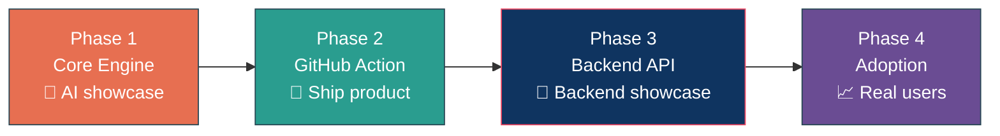
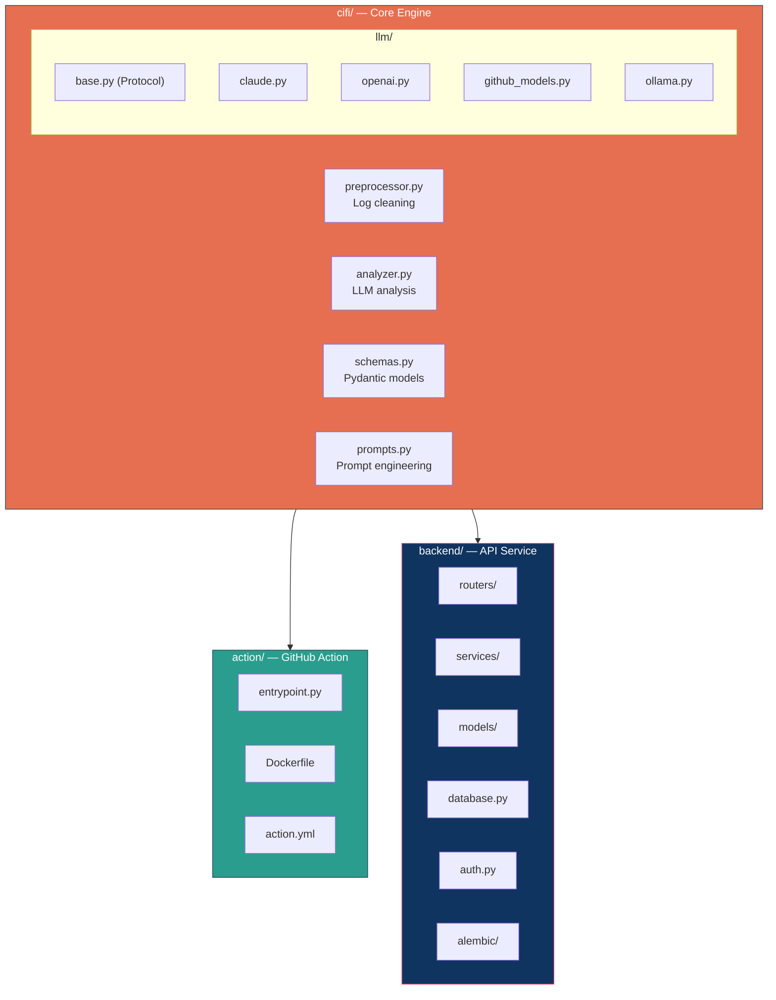

# Implementation Plan — CI Failure Intelligence (CIFI)

## TL;DR

Build an AI-powered CI failure analysis tool — a real AI engineering product with multi-provider LLM integration and structured prompting:



- **Phase 1 — Core Engine**: Python package with multi-provider LLM analysis. Structured prompting, Pydantic validation, provider-agnostic architecture. **The AI engineering showcase.**
- **Phase 2 — GitHub Action**: Package the engine as a GitHub Action. 3 lines of YAML, instant value. Publish to Marketplace. **Ship the product.**
- **Phase 3 — Backend API + Persistence**: Real FastAPI backend with PostgreSQL, API key auth, failure history, pattern detection. Deployed via Docker on a managed platform. **The backend engineering showcase.**
- **Phase 4 — Adoption + Growth**: Real users, blog post, demo content, marketplace traction. **Prove it solves a real problem.**

Phases 1-2 prove you can design AI-powered tools. Phase 3 proves you can build and deploy a real backend service. Phase 4 proves the product works in the real world.

**Deferred:** Deep infrastructure (EKS, Terraform modules, Kustomize overlays, Prometheus/Grafana), React dashboard, MCP server, CLI, Slack integration. These add operational complexity without core engineering signal — build later if needed.

---

## Phase 1: Core Engine — Multi-Provider LLM Analysis

**Goal**: Build the `cifi/` Python package — an AI-powered analysis engine with multi-provider LLM intelligence, structured prompting, and production-grade output validation.

**Steps**:
1. Create `cifi/` package with clean module structure
2. `cifi/preprocessor.py` — Intelligent log preprocessing: strip ANSI codes/timestamps, detect error boundaries, extract stack traces and assertion failures, truncate intelligently to fit LLM context window. This is where the real engineering lives — quality of analysis depends on quality of preprocessing.
3. `cifi/analyzer.py` — LLM analyzer: provider-agnostic LLM integration supporting GitHub Models API, Claude, OpenAI, and Ollama via a shared protocol. Structured prompting with JSON enforcement and Pydantic validation.
4. `cifi/schemas.py` — Pydantic models: `AnalysisResult` (failure_type, confidence, root_cause, contributing_factors, suggested_fix, relevant_log_lines). Force structured JSON output from LLM — always validate against schema
5. `cifi/llm/` — Multi-provider LLM integration: `base.py` (provider protocol), `github_models.py`, `claude.py`, `openai_provider.py`, `ollama.py`. Each provider handles auth, request formatting, response parsing, and retries
6. `cifi/prompts.py` — Prompt engineering: system prompt design, context window management, few-shot examples for edge cases, output format enforcement
7. `cifi/config.py` — Configuration: LLM provider, model, API keys via env vars
8. `cifi/ingestion.py` — Log ingestion: read CI logs and source code from local filesystem
9. Tests with realistic failure fixtures (test failures, build errors, infra errors, timeouts)
10. Root `Makefile` with targets: `test`, `lint`, `analyze-local`

**AI Engineering Highlights**:
- Provider-agnostic LLM integration via Python protocol classes
- Structured prompting with JSON enforcement and Pydantic validation
- Intelligent context window management (prioritize error region > stack trace > source > diff)
- Few-shot prompt design for edge cases
- GitHub Models API as default provider — free via `GITHUB_TOKEN`

**Verification**:
- Preprocessor strips noise and extracts error regions
- LLM analyzer produces accurate root cause analysis from preprocessed context
- LLM response validated against Pydantic schema — malformed responses caught and retried
- All tests pass with mocked LLM responses (no API key needed)
- Manual run with real API key returns valid `AnalysisResult`

**Human Checkpoint**: Review preprocessor quality, prompt design, LLM provider architecture, output schema.

---

## Phase 2: GitHub Action — Ship the Product

**Goal**: Package the core engine as a GitHub Action. When a CI step fails, CIFI analyzes the failure and posts a PR comment. Publish to GitHub Marketplace.

**Steps**:
1. Create `action.yml` — GitHub Action metadata (name, description, inputs, runs)
2. `action/entrypoint.py` — Main entry point: read CI logs, read source code from `$GITHUB_WORKSPACE`, run LLM analyzer, post PR comment
3. `action/Dockerfile` — Container Action image with cifi package installed
4. PR comment formatting — Markdown template with failure type, root cause, suggested fix, relevant log lines
5. GitHub API integration — Post PR comment using `GITHUB_TOKEN` (provided automatically)
6. GitHub Models API integration — Free LLM fallback using `GITHUB_TOKEN` (zero config)
7. Create a test repo with intentionally failing workflows for E2E testing
8. Publish Action to GitHub Marketplace
9. Makefile targets: `action-build`, `action-test`

**Usage**:
```yaml
- uses: alihaidar2950/cifi@v1
  if: failure()
  with:
    github-token: ${{ secrets.GITHUB_TOKEN }}
```

**Verification**:
- Action triggers on CI failure in test repo
- LLM analyzer produces accurate root cause analysis
- PR comment appears with structured analysis
- Works without any secrets beyond `GITHUB_TOKEN`
- Published and installable from GitHub Marketplace

**Human Checkpoint**: Review Action metadata, entrypoint, PR comment format, demo on real repo. **Product shipped.**

---

## Phase 3: Backend API + Persistence

**Goal**: Build a real FastAPI backend service with PostgreSQL persistence, API key authentication, failure history, and pattern detection. Deploy via Docker on a managed platform. This is a real backend — not a thin wrapper.

**Steps**:

### 3a. API Service
1. FastAPI app in `backend/` with proper project structure (routers, services, models, database)
2. `POST /api/analyze` — accepts log payload, runs LLM analyzer, stores result, returns analysis
3. `GET /api/failures` — list stored failures with pagination, filtering by repo/branch/date range
4. `GET /api/failures/{id}` — single failure detail
5. `GET /api/patterns` — recurring failure patterns across repos
6. `GET /api/health` — health check (DB connectivity + service status)
7. API key authentication middleware — secure all endpoints
8. Request validation, rate limiting, proper HTTP status codes and error responses
9. Structured JSON logging with request IDs for traceability
10. Makefile targets: `api-build`, `api-run`, `api-test`

### 3b. Database + Persistence
1. PostgreSQL database for failure history
2. SQLAlchemy ORM with async support (`asyncpg`)
3. Alembic migrations for schema management
4. Database models: `failures` table (analysis results + metadata), `patterns` table (recurring failures)
5. Pattern detection: hash-based matching (SHA-256 of normalized error + failure type), flag when `occurrence_count >= 3`
6. Docker Compose for local dev (API + PostgreSQL)

### 3c. Deployment + CI/CD
1. Dockerfile (multi-stage build) for the API
2. Deploy to Fly.io, Railway, or Cloud Run (pick simplest)
3. Managed PostgreSQL via platform (Fly Postgres / Railway Postgres / Cloud SQL)
4. Environment variables for DB connection, LLM config, API keys
5. HTTPS via platform (automatic)
6. GitHub Actions workflow: lint → test → Docker build → deploy
7. Database migration step in CI/CD pipeline
8. Health check verification after deploy

**Backend Engineering Highlights**:
- RESTful API design with proper resource modeling
- PostgreSQL + SQLAlchemy async ORM + Alembic migrations
- API key authentication middleware
- Pagination, filtering, error handling patterns
- Database-backed pattern detection (hash-based, not LLM)
- Docker Compose for local development, managed platform for production

**Verification**:
- API accessible at public URL with API key auth
- `POST /api/analyze` stores results and returns analysis
- `GET /api/failures` returns paginated results with filtering
- Pattern detection identifies recurring failures
- Alembic migrations run cleanly
- CI/CD pipeline deploys automatically on push
- Health check verifies DB connectivity

**Human Checkpoint**: Review API design, database schema, auth implementation, deployment config. **Real backend service.**

---

## Phase 4: Adoption + Growth

**Goal**: Get real users, create demo content, and establish CIFI as a legitimate open-source tool.

**Steps**:
1. **README**: Architecture diagram, demo GIF, install instructions (3-line quick start), badges
2. **Action README**: Marketplace listing with clear value prop, all inputs/outputs documented, examples
3. **Blog post**: Write about the multi-provider LLM analysis approach — structured prompting, provider abstraction, and production-grade AI integration
4. **Demo video**: Record a real CI failure → CIFI analysis → PR comment flow
5. **Real-world testing**: Add CIFI to 3-5 public repos (your own + open source contributions)
6. **Security hardening**: Log scrubbing before LLM, input validation audit
7. **Marketplace optimization**: Good description, screenshots, categories for discoverability

**Verification**:
- README makes a developer want to try it immediately
- Demo GIF shows real failure → analysis → fix cycle
- At least 3 repos using CIFI with real failure analyses
- Blog post published
- All tests pass in CI

**Human Checkpoint**: Review README quality, demo, real-world usage. **Portfolio-ready.**

---

## Deferred — Future Enhancements

These features add value but are separate career signals. Build them after Phases 1-4 are complete, if desired.

| Feature | What It Does | Notes |
|---|---|---|
| **Deep Infrastructure (EKS/Terraform)** | Production-grade K8s deployment with Terraform modules | Infra/platform career signal |
| **Kustomize + Prometheus/Grafana** | Multi-environment K8s + observability stack | Same — infra career signal |
| **React Dashboard** | Web UI showing failure history, trends, recurring patterns | Frontend signal |
| **CLI Tool** | `cifi history`, `cifi patterns`, `cifi status` via typer | Nice-to-have |
| **MCP Server** | Expose CIFI tools to AI agent workflows | AI-adjacent, good for later |
| **Slack Integration** | Failure summaries posted to Slack channels | Product feature |

Phase 3's backend is designed to be extensible — dashboard, CLI, and integrations can be added incrementally.

---

## Execution Principles

| Principle | How |
|---|---|
| **AI + backend engineering** | Phase 1-2 = AI showcase. Phase 3 = backend showcase. Both are core. |
| **Ship the product first** | Phases 1-2 prove you can build and ship AI-powered software |
| **Build a real backend** | Phase 3 has a real database, auth, persistence, and pattern detection — not a toy API |
| **Deploy simply** | Docker + managed platform. No infrastructure rabbit holes. |
| **Get real users** | Phase 4 proves the product solves a real problem |
| **Incremental delivery** | Each phase produces a working artifact. Never advance with broken tests. |
| **Human-in-the-loop** | Pause after each phase for review/approval before advancing. |
| **Test continuously** | Every phase adds tests. CI runs them automatically on every push. |
| **Real over impressive** | Every component solves an actual problem. No padding. |

---

## Decisions

| Decision | Rationale |
|---|---|
| **AI engineering + backend in one project** | Phase 1-2 = AI skills (multi-provider LLM integration, structured prompting, output validation). Phase 3 = backend skills (API design, PostgreSQL, auth, persistence). Both in one coherent product. |
| **LLM-powered analysis** | Demonstrates AI engineering depth: multi-provider abstraction, structured prompting, output validation. Production-grade LLM integration. |
| **Multi-provider LLM architecture** | Provider-agnostic design via Python protocols. Shows real LLM integration experience, not just "call OpenAI API". |
| **Structured prompting + Pydantic** | Force JSON output, validate against schema. Production-grade LLM integration, not notebook demos. |
| **Real backend, not a toy** | PostgreSQL + SQLAlchemy + Alembic + API key auth + pagination + pattern detection. This is backend engineering. |
| **Simple deployment (Docker + managed platform)** | Fly.io/Railway gives you a live URL + managed Postgres without infrastructure complexity. |
| **GitHub Marketplace** | Real distribution channel. Real users. Proves the product ships. |
| **GitHub Action as Tier 1** | Zero infra, marketplace distribution, 3-line adoption. The right distribution model. |
| **Deferred deep infra** | EKS/Terraform/Kustomize are valuable but are a separate career signal. Don't dilute the core story. |

---

## Project Structure



```
cifi/               # Core engine: preprocessor, analyzer, schemas
  llm/              # Multi-provider LLM integration (claude, openai, github-models, ollama)
  prompts.py        # Prompt engineering: system prompts, few-shot examples
  preprocessor.py   # Log preprocessing and context extraction
  analyzer.py       # LLM analyzer: multi-provider, structured prompting
  schemas.py        # Pydantic models for structured output
action/             # GitHub Action: entrypoint, Dockerfile, action.yml
backend/            # Backend API service (Phase 3)
  routers/          # FastAPI route handlers
  services/         # Business logic layer
  models/           # SQLAlchemy ORM models
  database.py       # DB connection + session management
  auth.py           # API key authentication
  alembic/          # Database migrations
docs/               # Design docs: HLD, DD, Plan, North Star
.github/            # Copilot instructions, CI/CD pipelines
```
